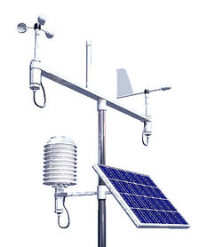

# metamet <a href="https://nerc-ceh.github.io/metamet/"></a>

<!-- README.md is generated from README.Rmd. Please edit that file -->


# metamet

<!-- badges: start -->
<!-- badges: end -->

`metamet` is an R package which attempts to solve many of the problems
encountered in working with meteorological observation data.
It provides a system for:

- standardising metadata
- converting between file formats
- converting between variable naming conventions
- converting units
- automating QA/QC
- facilitating manual QA/QC via a shiny app
- imputing missing values or "gap-filling"

It does this by defining:

1. a standardised generic data structure with enough complexity to hold both the 
observational data and the metadata, including site-specific, variable-specific 
and individual record-specific metadata; and
2. methods/functions for converting data between formats, combining data from 
different sources, quality control and gap-filling.

## Getting started with the Shiny app

`metamet` includes an interactive Shiny application for manual QA/QC and gap-filling of meteorological data. The app lets you build a `metamet` object from raw data files, inspect and correct observations interactively, and export the processed data.

### Install app dependencies

The app requires several additional packages that are not installed by default. Include them all at once with `pak`:


``` r
pak::pak("NERC-CEH/metamet", dependencies = TRUE)
```

Or install them individually:


``` r
install.packages(c(
  "shiny", "shinydashboard", "shinyjs", "shinyFiles",
  "shinyvalidate", "shinycssloaders", "ggiraph", "glue"
))
```

### Launch the app


``` r
metamet::run_shiny()
```

### App workflow overview

The app guides you through a four-stage workflow:

1. **Create or open a `metamet` object** – Use the *Create new Metamet object*
   wizard to import a raw data file (CSV, Campbell TOA5, old Campbell `.dat`/`.dld`,
   or CEDA BADC-CSV), map variables to ICOS names, set QC ranges, and optionally
   attach ERA5 reference data. The wizard saves the result as a `.rds` file.
   Alternatively, use *Open existing Metamet object* to load a previously saved `.rds`.

2. **Select date range and QA/QC** – Choose a start and end date/time, click
   *Retrieve from database*, then inspect each variable in its own interactive
   plot tab. Select suspect data points with the lasso tool, pick a gap-filling
   method (time interpolation, regression, ERA5 substitution, or others), add an
   optional comment explaining the change, and click *Impute selection*. Click
   *Finished checking variable* when a variable is signed off.

3. **Save changes** – Click *Save changes* to write a new `.rds` file (named with
   your system username and today's date) plus a CEDA-formatted output in the same
   directory as the source file.

4. **Download processed data** – Export Level 1, Level 2, or CEDA-formatted data
   as `.csv` (or `.zip` for Level 1/2) from the *Download processed data* tab.

For a detailed walkthrough see the
[App User Guide](https://nerc-ceh.github.io/metamet/articles/app_user_guide.html).

## Basic metamet workflow - create a metamet object without the app

Basic usage is to first create `metamet` objects from files or pre-existing data 
frames or data tables. Because all the metadata describing the observations is
available in the structure, objects can be processed relatively easily so as to:

- rename variables in standard naming conventions
- combine data from different sites
- apply quality control
- impute missing data.


``` r
library(metamet)
fname_dt <- testthat::test_path("data-raw/UK-AMO/UK-AMO_BM_dt_2026.csv")
fname_meta <- testthat::test_path("data-raw/dt_meta.xlsx")
fname_site <- testthat::test_path("data-raw/dt_site.csv")

mm <- metamet(
  dt = fname_dt,
  dt_meta = fname_meta,
  dt_site = fname_site,
  site_id = "UK-AMO"
)
#> Loading file: tests/testthat/data-raw/UK-AMO/UK-AMO_BM_dt_2026.csv
#> Error in `read_obs_autodetect()`:
#> ! file.exists(path) is not TRUE

# print the outline strucutre:
mm
#> Error:
#> ! object 'mm' not found
```

A typical workflow would go on to perform tasks such as adding reference data 
from ECMWF ERA5 reanalysis, join with other `metamet` objects, apply quality 
control algorithms, impute missing values by various algorithms, and check the 
data manually for additional QC. This is illustrated  below.


``` r
mm <- add_era5(
  mm,
  fname_era5 = testthat::test_path("data-raw/dt_era5.csv")
)
mm <- join(mm, mm_old)
mm <- apply_qc(mm)
mm <- impute(mm = mm)
run_shiny()
```


Clearly a two-dimensional data table is not sufficient to hold all the 
information. Instead we define a `metamet` data object as a set of related data 
tables. We implement this as a list in R, containing five data tables (prefix `dt_`) 
explained in the table below.

| Name | Type | Contains | Rows correspond to | Columns correspond to |
|---|---|---|---|---|
| dt | data.table | sensor data | time intervals | variables |
| dt_meta | data.table | variable- and time-specific meta data (like netCDF data attributes) e.g. coords for sensor locations | variables x time period | metadata variables |
| dt_site | data.table | site-specific meta data (like netCDF global attributes) | sites | metadata variables |
| dt_qc | data.table | QC codes | time intervals | variables |
| dt_ref | data.table | ref data e.g. era5 | time intervals | variables |

