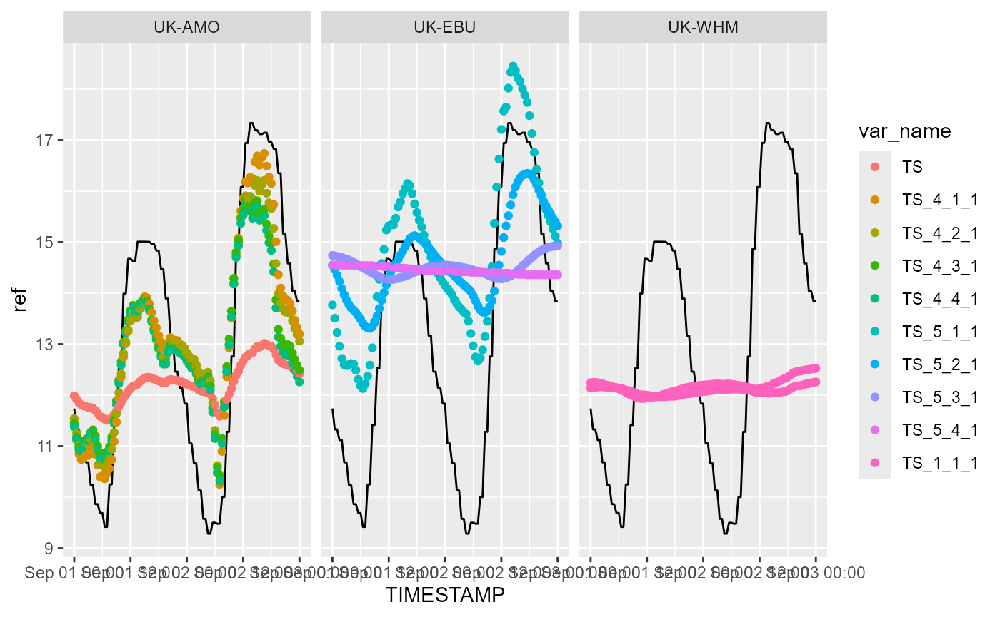
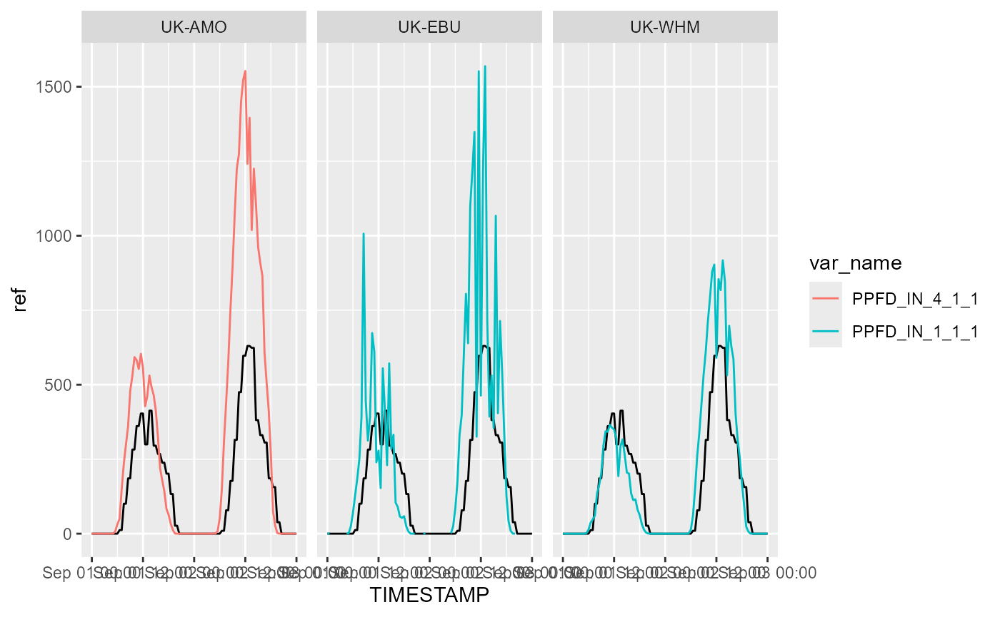
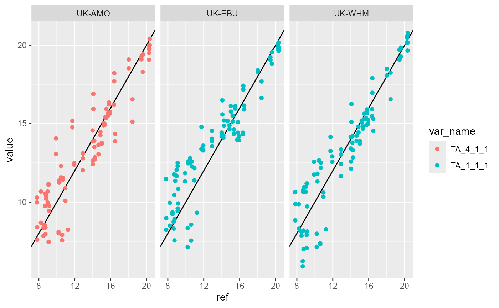

# Workflow Example 2 - Multiple Sites

This vignette illustrates the typical workflow for quality control of
met data from multiple sites simultaneously with `metamet`. We assume
that the basic steps have been carried out already: reading the raw
observation data, creating systematic metadata for the variables and
each site (described in [Workflow Example
1](https://nerc-ceh.github.io/metamet/articles/workflow_example.md)).
This produces a single `metamet` object for each site.

First, we load the `metamet` library, and read the data for each of
three sites from file.

``` r
here::i_am("vignettes/workflow_example.Rmd")
library(here)
library(metamet)

mm_amo <- readRDS(
  file = here::here("data-raw/UK-AMO/UK-AMO_BM_mm_2023.rds")
)
mm_ebu <- readRDS(
  file = here::here("data-raw/UK-EBU/UK-EBU_BM_mm_2023.rds")
)
mm_whm <- readRDS(
  file = here::here("data-raw/UK-WHM/UK-WHM_BM_mm_2023.rds")
)
```

This gives us all the half-hourly data for 2023 from each site. If we
want to process a shorter time period, we can subset as required with
`subset_by_date`. Here we look at two days just for speed.

``` r
mm_amo <- subset_by_date(mm_amo, "2023-09-01", "2023-09-03")
mm_ebu <- subset_by_date(mm_ebu, "2023-09-01", "2023-09-03")
mm_whm <- subset_by_date(mm_whm, "2023-09-01", "2023-09-03")
```

In order to combine data from different sites in a meningful way, they
all need to use the same naming convention. Here we convert two of the
sites to the ICOS convention using the `change_naming_convention`
function below (UK-AMO data are already produced in this form).

``` r
mm_ebu <- change_naming_convention(mm_ebu, name_convention = "name_icos")
mm_whm <- change_naming_convention(mm_whm, name_convention = "name_icos")
```

Although the base names of variable are now standardised across sites,
the specific variables measured will vary across sites. For example, one
site may have two replicate measurements of air temperature TA_4_1_1 and
TA_5_1_1, while another has a single replicate TA_1_1_1. These cannot be
combined as a single variable (or related variables) in wide format.
Also, wide format would require columns for the full set of variables
found across all sites, many of which will be empty for all sites except
one. The efficient solution is to convert to long format, so all values
are in a single column, with additional columns to identify the site,
timestamp, varaiable type and specific varaiable name. We do this with
the `reshape_wide_to_long` function, shown below.

``` r
mm_amo <- reshape_wide_to_long(mm_amo)
mm_ebu <- reshape_wide_to_long(mm_ebu)
mm_whm <- reshape_wide_to_long(mm_whm)
```

We can now see the structure of UK-AMO data

``` r
mm_amo$dt
#> Key: <site, TIMESTAMP, var_name>
#>         site  TIMESTAMP          var_name       value          type   name_icos
#>       <char>     <POSc>            <fctr>       <num>        <char>      <char>
#>    1: UK-AMO 2023-09-01                TS  11.9883733   temperature          TS
#>    2: UK-AMO 2023-09-01               SWC  75.7355696 soil moisture         SWC
#>    3: UK-AMO 2023-09-01                 G   1.2816722   energy flux           G
#>    4: UK-AMO 2023-09-01               WTD  -0.3445917        height         WTD
#>    5: UK-AMO 2023-09-01         WTD_4_1_1          NA        height         WTD
#>   ---                                                                          
#> 3585: UK-AMO 2023-09-03 NDVI_649OUT_5_1_1          NA   energy flux NDVI_649OUT
#> 3586: UK-AMO 2023-09-03  NDVI_797IN_5_1_1          NA   energy flux  NDVI_797IN
#> 3587: UK-AMO 2023-09-03 NDVI_797OUT_5_1_1          NA   energy flux NDVI_797OUT
#> 3588: UK-AMO 2023-09-03         LWS_4_1_1 360.6000000     arbitrary         LWS
#> 3589: UK-AMO 2023-09-03         LWS_4_1_2 285.0000000     arbitrary         LWS
#>          qc validator           ref
#>       <num>    <char>         <num>
#>    1:     0      auto  1.173913e+01
#>    2:     0      auto  3.360330e+01
#>    3:     0      auto -6.467518e-14
#>    4:     0      auto  3.360330e+01
#>    5:     1      auto  3.360330e+01
#>   ---                              
#> 3585:     1      auto  0.000000e+00
#> 3586:     1      auto  0.000000e+00
#> 3587:     1      auto  0.000000e+00
#> 3588:     0      auto  8.707268e+01
#> 3589:     0      auto  8.707268e+01
```

and see it is identical to the structure of UK-EBU (and UK-WHM) data.

``` r
mm_ebu$dt
#> Key: <site, TIMESTAMP, var_name>
#>         site  TIMESTAMP  var_name   value          type name_icos    qc
#>       <char>     <POSc>    <fctr>   <num>        <char>    <char> <num>
#>    1: UK-EBU 2023-09-01  RH_1_1_1  90.100      humidity        RH     0
#>    2: UK-EBU 2023-09-01  TA_1_1_1   9.320   temperature        TA     0
#>    3: UK-EBU 2023-09-01 LWS_7_1_1 286.500     arbitrary       LWS     0
#>    4: UK-EBU 2023-09-01  PA_1_1_1  98.700      pressure        PA     0
#>    5: UK-EBU 2023-09-01   P_1_1_1   0.000 precipitation         P     0
#>   ---                                                                  
#> 1839: UK-EBU 2023-09-03  TS_5_3_1  14.930   temperature        TS     0
#> 1840: UK-EBU 2023-09-03  TS_5_4_1  14.360   temperature        TS     0
#> 1841: UK-EBU 2023-09-03   G_5_1_1   0.171   energy flux         G     0
#> 1842: UK-EBU 2023-09-03   G_5_2_1  -3.032   energy flux         G     0
#> 1843: UK-EBU 2023-09-03 WTD_5_1_1  -0.576        height       WTD     0
#>       validator      ref
#>          <char>    <num>
#>    1:      auto 88.06677
#>    2:      auto 11.23692
#>    3:      auto 88.06677
#>    4:      auto 97.53844
#>    5:      auto  0.00000
#>   ---                   
#> 1839:      auto 13.84093
#> 1840:      auto 13.84093
#> 1841:      auto  0.00000
#> 1842:      auto  0.00000
#> 1843:      auto 32.56382
```

Given this structure, we can simply append all the rows for all data
tables to create a single `metamet` object.

``` r
mm <- rbind_metamet(
  mm_amo,
  l_dt = list(mm_amo$dt, mm_ebu$dt, mm_whm$dt),
  l_dt_meta = list(mm_amo$dt_meta, mm_ebu$dt_meta, mm_whm$dt_meta),
  l_dt_site = list(mm_amo$dt_site, mm_ebu$dt_site, mm_whm$dt_site)
)
```

We can now plot all the variables of a given type for all the types,
identifying site by colour or separate panels (facets). Below we plot
soil temperature against time; the solid black line shows the reference
data, which in this case is ERA5 reanalysis data for the grid cell
containing the site.

``` r
p <- ggplot(
  mm$dt[name_icos == "TS", ],
  aes(TIMESTAMP, value, colour = var_name)
)
p <- p + geom_line(aes(y = ref), colour = "black")
p <- p + geom_point()
p <- p + facet_wrap(~site)
print(p)
```



Below we plot PPFD (photosynthetic photon flux density, commonly ‘PAR’)
against time; the solid black line shows the ERA5 reference data.

``` r
p <- ggplot(
  mm$dt[name_icos == "PPFD_IN", ],
  aes(TIMESTAMP, value, colour = var_name)
)
p <- p + geom_line(aes(y = ref), colour = "black")
p <- p + geom_line(alpha = 1.0)
p <- p + facet_wrap(~site)
print(p)
```



We can also plot all variable against the reference (ERA5) data to check
for anomalous deviations from the expected relationship.

``` r
p <- ggplot(
  mm$dt[name_icos == "TA", ],
  aes(ref, value, colour = var_name)
)
p <- p + geom_abline()
p <- p + geom_point()
p <- p + facet_wrap(~site)
print(p)
```


